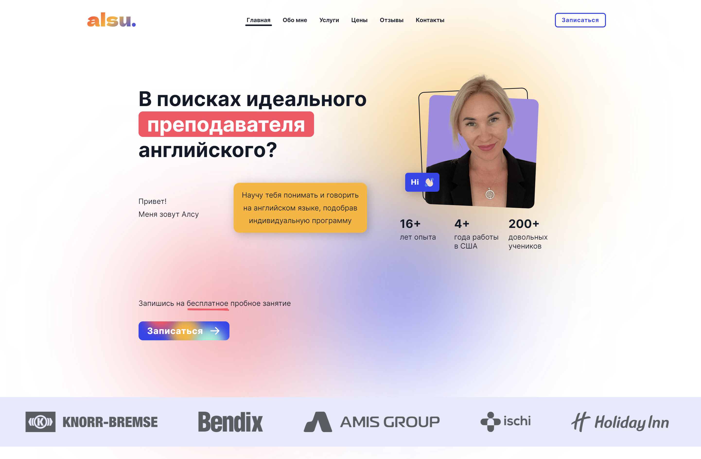

# ALSU.ME

## Description

### A personal website of Alsu Karimova - a professional tutor, translator & interpreter

### Features

- Compelling UI & Solid UX
- Major browser compatibility
- 3 Adaptive layouts + Responsiveness
- 6 sections
- Dynamic animated header
- Animations on scroll (\* no Safari support at the moment)
- Animated Hero section
- Animated CTA
- Animated infinite logos & testimonials
- Complex photo animations
- Micro animations

### Dependencies

- `Vite`
- `React` • `Tailwind`

## Installation & Execution

### Install via Vite:

    npm create vite@latest
    cd my-project
    npm install

### Run in the development mode:

    npm run dev

Vite will start frontend server on http://localhost:5173/

## Building and Running for Production

    npm run build
    npm run preview

Vite will start frontend server on http://localhost:4173/

## Licence

### MIT license

You can use the code, but I ask you do not copy this site without giving me credit.

## Version History

- 1.0.0 First Release
